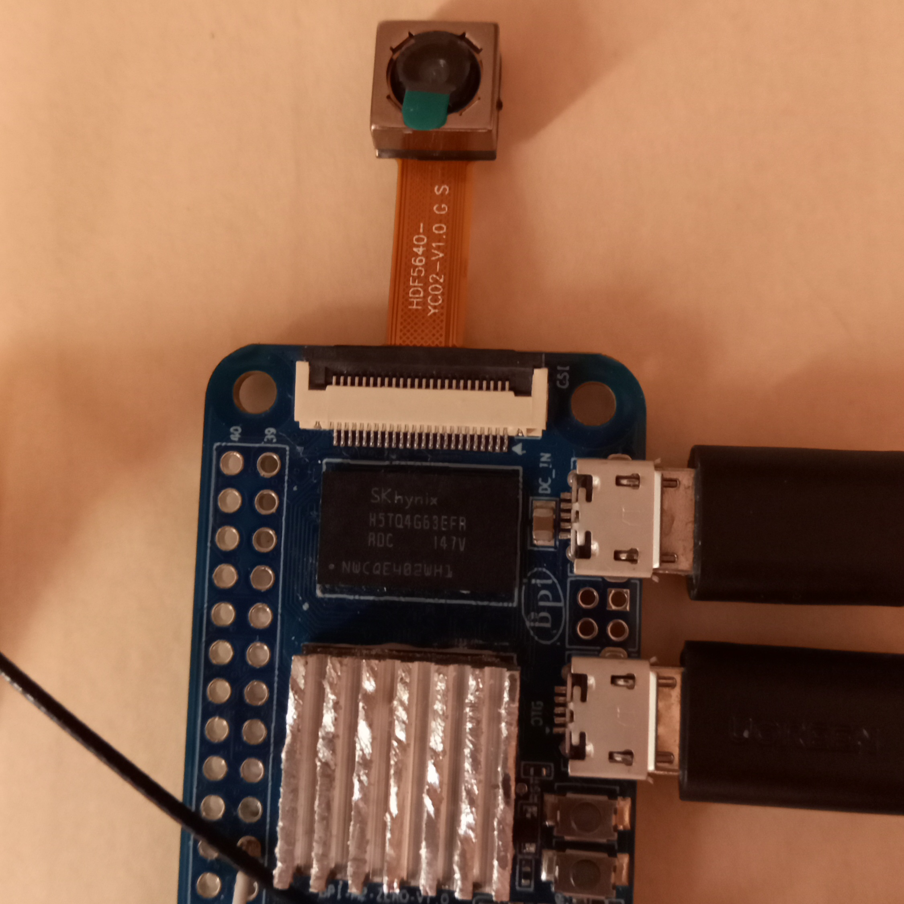

Banana Pi Camcorder
===============
Using Banana Pi M2 Zero, OV5640 image sensor and Cedrus H264 hardware encoder to record & stream video.

Preparation:  
0. Make sure your power supply can output 2A current at 5V, otherwise the system will hang randomly, but 2A peaks are rare and instantaneous.
1. Clean Armbian install (Armbian_21.08.1_Bananapim2zero_buster_current_5.10.60), with root permissions.
2. All the following commands should be performed as root.
3. Connect to Wi-Fi:  
`nmtui`
3. APT:  
`apt update`   
`apt upgrade`
4. Reboot and find out kernel version after apt upgrade:  
`uname -r`
5. Install Linux sources:  
`apt install linux-source-<result>`  
Where result is what uname -r returned.
6. Unpack Linux sources:  
`cd /usr/src`  
`mkdir linux`  
`tar xvf linux-source-<version>.tar.xz -C ./linux/`  
7. Copy current distribution config to downloaded sources:  
`cp /boot/config-<version> /usr/src/linux/arch/arm/configs/bananapi-m2-zero_defconfig`  

OV5640 driver:  
1. Copy modified device tree files from this repository to these sources:  
`cd /usr/src/linux`  
`cp /this/repo/sun8i-h3.dtsi arch/arm/boot/dts/`  
`cp /this/repo/sun8i-h2-plus-bananapi-m2-zero.dts arch/arm/boot/dts/`  
You can modify them accordingly instead of replacing original ones with mine.  
2. Compile new device tree:  
`make bananapi-m2-zero_defconfig`  
`make dtbs`  
3. Install new device tree:  
`cp arch/arm/boot/dts/sun8i-h2-plus-bananapi-m2-zero.dtb /boot/dtb/`  
4. Reboot and make sure OV5640 and CMA reserved memory are working:  
`dmesg | grep CMA`  
`dmesg | grep OF`  
`dmesg | grep ov5`  
5. Install utils:  
`apt install v4l-utils libv4l-dev libmp3lame-dev libpulse-dev`  
6. Test camera initialization:  
`media-ctl -v --device /dev/media0 --set-v4l2 '"ov5640 0-003c":0[fmt:YUYV8_2X8/1280x720@1/15]'`  

Cedar H264 encoder:  
1. Compile Linux kernel:  
`cd /usr/src/linux`  
`make LOCALVERSION="-sunxi" -j4 zImage modules dtbs`  
2. Get Cedar:  
`cd /usr/src`  
`git clone https://github.com/uboborov/sunxi-cedar-mainline`  
`cd sunxi-cedar-mainline`  
3. Compile Cedar:  
`make LOCALVERSION="-sunxi"`  
4. Install Cedar:  
`cp cedar_ve.ko /lib/modules/<version>/`  
`depmod`  
`echo cedar_ve | tee -a /etc/modules`  
5. Reboot and check:  
`dmesg | grep cedar`  
6. Diagnose CONFIG_CMA if needed.  

FFMPEG:  
1. Install libcedrus:  
`cd ~`  
`git clone https://github.com/linux-sunxi/libcedrus`  
`cd libcedrus`  
`make && sudo make install`  
2. Install libvdpau (used for decoding):  
`apt install libvdpau-dev`  
3. Install libx264:  
`cd ~`  
`wget https://download.videolan.org/pub/videolan/x264/snapshots/x264-snapshot-20180121-2245-stable.tar.bz2`  
`tar xf x264-snapshot-20180121-2245-stable.tar.bz2`  
`cd x264-snapshot-20180121-2245-stable/`  
`./configure --enable-static --enable-shared`  
`make -j4`  
`make install`  
`ldconfig`  
4. Install FFMPEG:  
`cd ~`  
`git clone --depth=1 https://github.com/stulluk/FFmpeg-Cedrus.git`  
`git clone https://github.com/uboborov/ffmpeg_h264_H3.git`  
`cp ffmpeg_h264_H3/cedrus264.c FFmpeg-Cedrus/libavcodec/cedrus264.c`  
`cp -R ffmpeg_h264_H3/sunxi FFmpeg-Cedrus/libavcodec/arm`  
`cd FFmpeg-Cedrus`  
`apt install libasound2-dev`  
`./configure --prefix=/usr --enable-nonfree --enable-gpl --enable-version3 --enable-vdpau --enable-libx264 --enable-libmp3lame --enable-libpulse --enable-libv4l2 --enable-indev=alsa --enable-shared  `  
`make`  
5. It will give a relocation error, fix it by:  
`rm libavcodec/xface.o`  
`make`  
`make install`  
  
Testing:  
`./record.sh`  

Power Loss Protection:  
`nano /etc/fstab`  
Change commit to 60
  
Full recording (with USB audio):  
`./record_with_audio.sh`  
  
Install services:  
`cd /this/repo/`  
`cp *.service /etc/systemd/system/`  
`cp *.sh /root/`  
`cp streaming_target.conf /root/`  
`systemctl daemon-reload`  

Streaming:  
Update streaming_target.conf accordingly and then:  
`systemctl start bpi-streamer`  

Watching:  
`./playstream.sh`  
